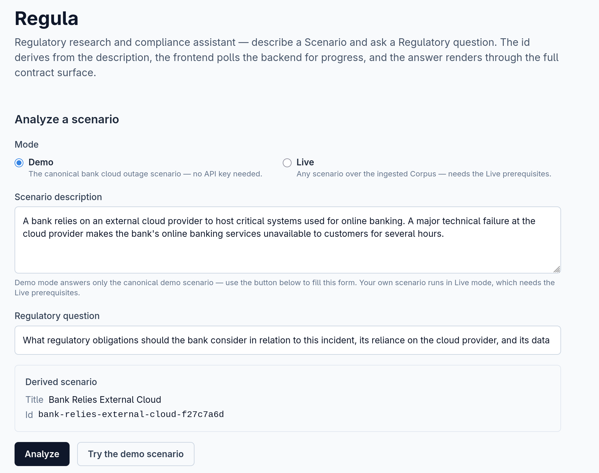
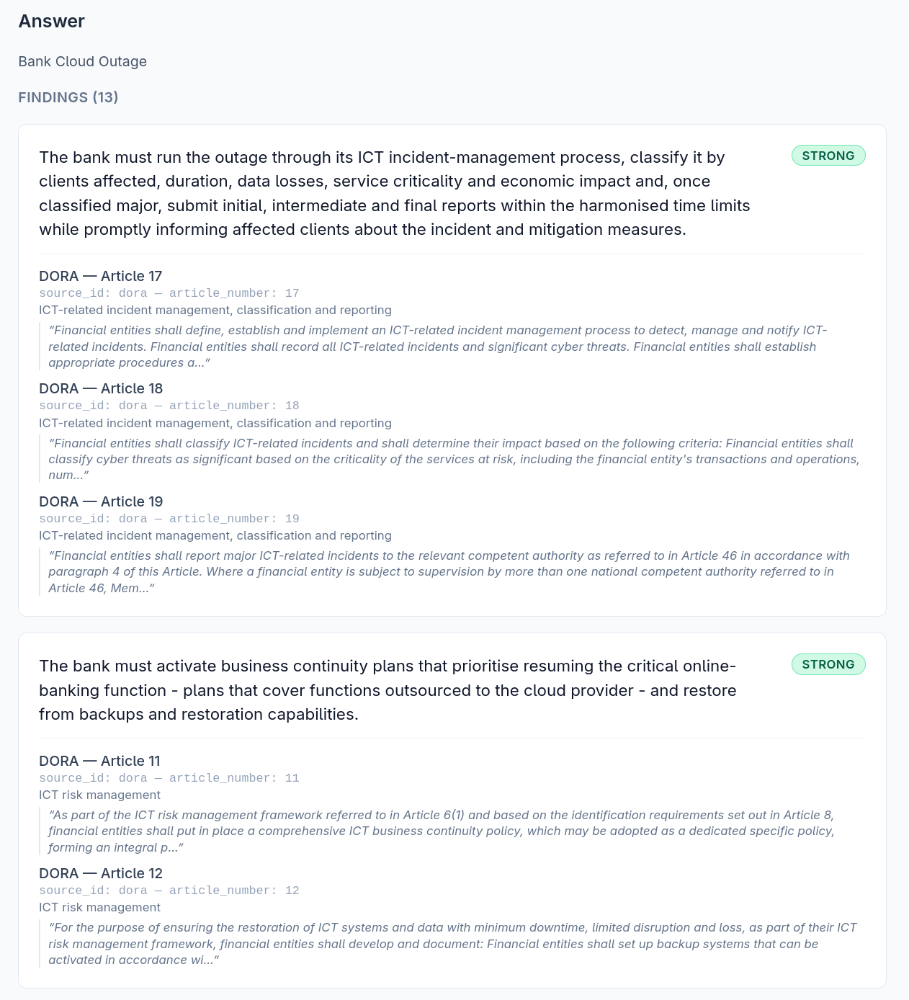
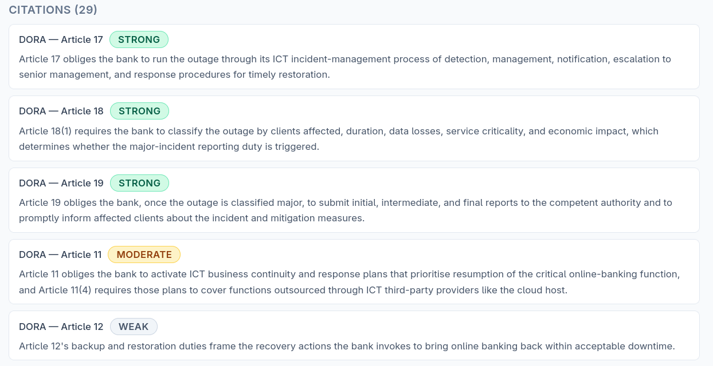
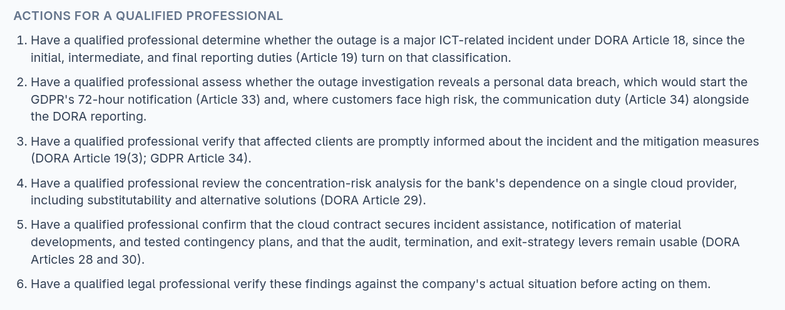
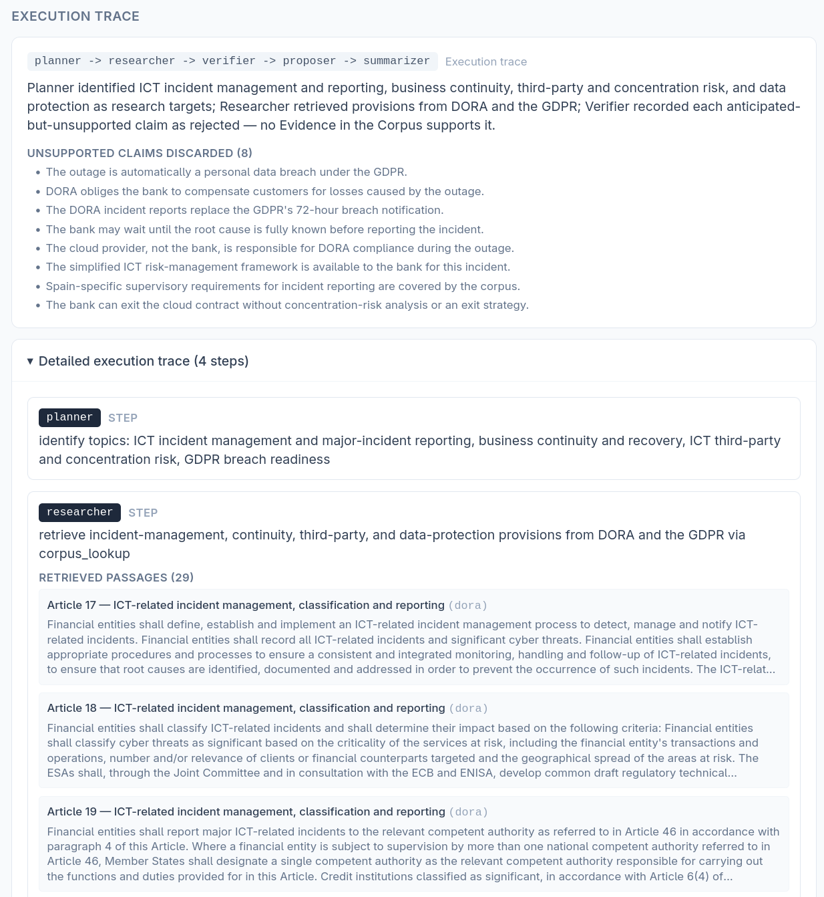
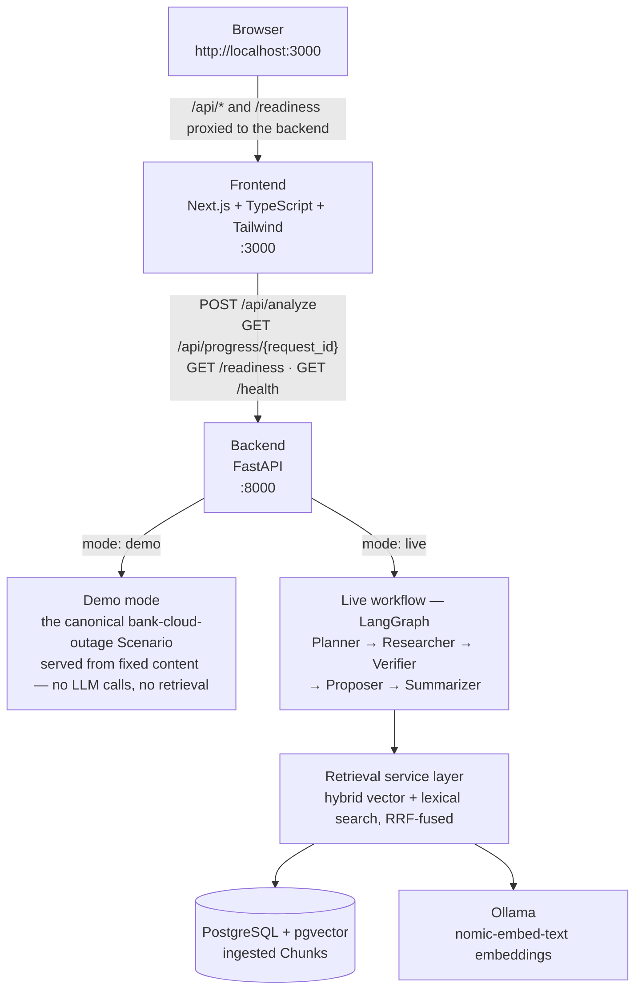

# Regula — Agentic RAG Pipeline for EU Regulatory Compliance Research

Regula answers "what regulations apply to us, and what must we do about it?" for a described business situation. You describe your company, product, and jurisdiction as a **Scenario**, ask a regulatory question, and get an evidence-backed **Answer**: Findings with Strength badges, per-provision Citations with their answer-wide relevance and Citation strength, and Actions naming what only a qualified legal professional can settle. Regula never dispenses legal advice and never substitutes for professional judgment.

Under the hood it is an agentic retrieval pipeline (LangGraph) over a small, curated corpus of EU regulations — the AI Act, GDPR, and DORA — running permanently on your own machine: four containers started by one Docker Compose command. Two modes serve every request: a keyless deterministic **Demo** and a **Live** mode that runs the real workflow over the ingested Corpus with your own LLM provider key.

## What it looks like


*Describing the bank cloud outage Scenario and its Regulatory question in Demo mode — no API key needed.*


*The Answer: Findings with Strength badges, each backed by its supporting provisions' quoted text.*


*Citations: every cited provision with its answer-wide relevance and Citation strength badge.*


*Actions: what only a qualified legal professional can settle before acting on the Answer.*


*The Execution trace: Planner → Researcher → Verifier → Proposer → Summarizer, with Unsupported claims discarded and every retrieved passage visible.*

## Architecture



The four containers — frontend, backend, PostgreSQL with pgvector, and Ollama — come up together with `docker compose up -d --build`.

A Live run is grounded and budgeted at every step. The **Planner** decomposes the question into one to fifty Research targets, guided by the Corpus's own inventory of titled provisions (ADR-0012, ADR-0015, ADR-0018) rather than model memory alone. Each target searches the ingested Corpus twice — semantically by embedding and lexically by Postgres full-text search — and the two ranked lists fuse by reciprocal rank fusion, so provisions surface by meaning and by their exact legal terminology alike; the per-target results fill one shared Evidence pool, and a question where neither leg finds a single Chunk surfaces as the Insufficient-evidence Known limitation, with suggested Actions and no Findings, instead of a hollow answer. The **Researcher** drafts only Claims that bear on the question asked for the Scenario, and the **Verifier** discards abstract restatements that do not — Findings state what the Scenario's actors must or must not do, not what the law says in general.

## Quickstart

Everything below runs from a fresh clone; Docker with Compose is the only tooling you need for the containerized path. Demo mode works immediately — no API key, no model pull, no ingest. Live mode adds three one-time prerequisites, marked below. The subsection at the end runs the backend and frontend on the host instead — the development path.

1. **Clone and configure:**
```bash
git clone https://github.com/RodrigoCovas/regula.git
cd regula
cp .env.example .env
```
Set `OPENROUTER_API_KEY` in `.env` to your provider key. Demo mode needs no key — leave it empty if you only want the demo. Compose reads this file automatically; it is the one configuration file a Docker deployment touches.

2. **Start the stack:**
```bash
docker compose up -d --build
```
The image build takes about a minute when warm (the first build on a machine also downloads base images). You end up with the web UI on http://localhost:3000, the API on port 8000, PostgreSQL with pgvector, and Ollama.

3. **Analyse your first scenario (Demo mode — works immediately):**
Open http://localhost:3000 and click **Try the demo scenario**. The answer arrives as Findings (each with a Strength badge), Citations with their Provision relevance and Citation strength, and Actions, alongside the execution trace and known limitations. Via the API instead:

```bash
curl -s http://localhost:8000/api/analyze \
  -H "Content-Type: application/json" \
  -d '{
    "mode": "demo",
    "scenario": {"id": "bank-cloud-outage", "description": "A bank relies on an external cloud provider to host critical systems used for online banking. A major technical failure at the cloud provider makes the bank's online banking services unavailable to customers for several hours."},
    "question": "What regulatory obligations should the bank consider in relation to this incident, its reliance on the cloud provider, and its data protection obligations towards customer data on the disrupted systems?"
  }'
```
Demo mode serves only the canonical bank cloud outage Scenario; any other scenario id in Demo mode gets a Not-available response explaining the keyless demo.

4. **Check what is ready:**
```bash
curl http://localhost:8000/health
curl http://localhost:8000/readiness
# {"api_key_set":true,"embedding_model_present":false,"corpus_ingested":false}
```
`/health` is liveness only; `/readiness` reports the three Live-mode prerequisites as independently probed booleans. The example assumes the step-1 key is configured; a demo-only setup reads `api_key_set:false` — everything else below is unchanged. The other two booleans flip with the one-time prep in the next step.

5. **One-time Live prep — pull the embedding model, then ingest the Corpus:**
```bash
docker compose exec ollama ollama pull hf.co/nomic-ai/nomic-embed-text-v1.5-GGUF:F16
```
The pull takes ≈25 s. Then ingest (idempotent — re-running updates existing rows and inserts no duplicates):
```bash
docker compose exec backend python -m backend.src.ingest
```
Ingest embeds every Chunk of the three regulations locally with the pulled model and upserts it into PostgreSQL/pgvector with its provision metadata. Expect ≈6 min on CPU for the 764 Chunks — this is the slowest step in the guide, and it runs once. Ingest also reports any non-corpus JSON it skips (the eval ground truth `citations.json` lives beside the Corpus). Two things are normal on the way: before the first ingest, `docker compose logs backend` shows `WARNING: Could not check whether the Corpus is ingested (relation "chunks" does not exist)` on every boot — expected on a fresh stack, gone after ingesting. `/readiness` flips one boolean per step: `{true,false,false}` → `{true,true,false}` → `{true,true,true}`.

6. **Run a Live analysis.**
Switch the toggle to **Live** in the web UI and submit any scenario and question. The form hard-blocks Live until `/readiness` reads all-true, showing exactly which prerequisites are missing and the command for each (see [Modes & Readiness](#modes--readiness)). If you set the key in `.env` after starting the stack, run `docker compose up -d` once more so the backend container is recreated with it. A Live run answers through the real workflow over the ingested Corpus and the configured LLM; expect about 3 minutes per scenario, with the UI polling the progress endpoint and displaying each phase as it completes.

7. **Stop or reset:**
```bash
docker compose down        # stop; volumes (ingested Corpus, pulled model) survive
docker compose down -v     # full reset to fresh-clone state, including the Corpus and model
```

### Run the backend and frontend on the host

The development path, without Docker for the two apps: stop the stack's containers so the ports are free, then run each app.

```bash
# backend (Python 3.13+), from the repository root
docker compose stop backend frontend
pip install -r backend/requirements.txt
python -m uvicorn backend.src.main:app --reload --reload-dir backend/src
```

```bash
# frontend (Node.js 20+)
cd frontend
npm install
npm run dev
```

The notes that matter for development — the shared root `.env`, the endpoint overrides, the reload scoping — are under [Development](#development).

## Configuration

All configuration lives in the root `.env` (copied from `.env.example` in the Quickstart) — the one configuration file a Docker deployment and a host-run backend share. Every variable is optional: deleting one or leaving it empty falls back to the backend's built-in default, except the key, whose emptiness means "not configured".

| Variable | Default | Meaning |
|---|---|---|
| `OPENROUTER_API_KEY` | *(empty)* | Provider key. Live mode needs it; Demo mode is keyless. The variable's name is historical — it holds whichever provider's key you use. |
| `LLM_MODEL` | `upstage/solar-pro4` | The chat model every completion asks for. Solar Pro 4 is the suggested default, not a requirement. |
| `LLM_BASE_URL` | `https://openrouter.ai/api/v1` | OpenAI-compatible base URL ending at the version root — the client appends `/chat/completions` itself. |
| `EMBEDDING_MODEL` | `hf.co/nomic-ai/nomic-embed-text-v1.5-GGUF:F16` | Always served by the local Ollama. Changing it requires re-pull and re-ingest. |
| `REGULA_MODE` | `demo` | Server-side default mode for requests that omit `mode`. |

Provider notes worth knowing before you switch away from the default:

- **OpenRouter is the tested path.** Any OpenAI-compatible chat endpoint works the same way (`LLM_BASE_URL` + key in `OPENROUTER_API_KEY`): OpenAI, Groq, or a local server.
- **Local keyless servers still need a non-empty key value.** A Live-mode request without a configured key answers Not-available, and the client always sends the Bearer header — set `OPENROUTER_API_KEY=ollama` (any placeholder) for Ollama, vLLM, or LM Studio.
- **Avoid reasoning models.** The client sends `max_tokens` (the locked budget); OpenAI's o-series and gpt-5 reasoning models reject that parameter. Standard chat models — GPT-4o, Llama, Solar Pro 4 — accept it.
- **Embeddings are not covered by the provider switch.** They always run on local Ollama, and the pgvector column is fixed at nomic's 768 dimensions.
- **Results are model-sensitive** (ADR-0009): evaluation numbers are comparable only within the model that produced them — see [Evaluation](#evaluation).

Running the backend outside Docker (backend development, tests) reads the same variables from the same root `.env` — see `.env.example`.

## Modes & Readiness

Mode is a per-run choice (ADR-0008): every analysis request carries `mode` explicitly, and a request that omits it gets the server default (`REGULA_MODE`, itself defaulting to Demo). One running backend serves both modes. The web UI exposes the choice as a Demo/Live toggle that defaults to Demo on every page load and never persists.

- **Demo mode** (`mode: "demo"`) — keyless, deterministic, immediate. Serves only the canonical bank cloud outage Scenario (`bank-cloud-outage`) from fixed content; derived scenario ids never trigger it (ADR-0005).
- **Live mode** (`mode: "live"`) — answers arbitrary scenarios through the real workflow: Planner → Researcher → Verifier → Proposer → Summarizer, retrieving Chunks from the ingested pgvector Corpus through hybrid lexical + vector search and producing evidence-backed Findings with Strength badges, metadata-derived Citations with Provision relevance and Citation strength, and Actions.

**Readiness** is the state that lets Live mode execute: a configured provider key, the embedding model available, and a non-empty ingested Corpus. `GET /readiness` probes each independently on every call and reports them as booleans — an unreachable Ollama or vector store reads `false`, never an error, so the endpoint is safe to poll while the stack comes up.

The checklist is how the UI enforces it. With Live selected and a prerequisite missing, the form hard-blocks submission and renders exactly the missing items — provider key (`OPENROUTER_API_KEY`), embedding model, ingested Corpus — each with a note and the verbatim command that fixes it, as text only. The UI never runs a pull, an ingest, or a key change for you; the three commands are the ones in the Quickstart's one-time prep.

The backend is the backstop: a Live request that races readiness, or a direct API caller, receives a Not-available response naming the missing prerequisite and its fix — never a server error, and never a boot refusal, since the stack always comes up ready to serve Demo mode.

## Evaluation

Answer quality is scored as two components, reported separately and **never blended** (ADR-0010):

- **Provision coverage** — a deterministic weighted set precision/recall/F1 over Citation targets (provision kind + number, never label strings). The expected side is weighted by the operator's per-provision Strength ratings (strong = 50, moderate = 5, weak = 1; expected side only — the produced side's ratings never touch coverage); every off-target produced Citation counts against precision.
- **Summary fidelity** — a strict rubric judge (the same configured provider, one batched call per case, schema-validated verdicts) compares provision-aligned Provision relevance against hand-authored ground-truth summaries; a contradiction between the two forces the floor score.

The Summarizer still rates each cited provision's centrality (ADR-0011) — strong when the provision directly imposes or decides the obligations the Answer turns on, moderate when it is a supporting duty or factor, weak when it is definitional or framing — and the same rating shows on the citation badges and in the audit dump. The ratings feed no scored metric: the operator's ratings weight recall on the expected side only, and the produced ratings are read by eye in the dump, never scored against them.

### Results

The tables below freeze the repository's committed 2026-09-10 artifacts: the ten hand-authored Live cases, model `z-ai/glm-5.3-flash`, the pipeline scored against the same gold answers as two agent-produced baselines (ADR-0017). A baseline answers without the workflow's retrieval-and-verification machinery — one structured completion per case from a locked prompt template, produced outside the system — either from model memory alone (**parametric**) or with the entire Corpus in context (**full-corpus**), then scored by exactly the harness a pipeline run goes through.

**Provision coverage** — weighted set precision (P), recall (R), and F1:

| Case | Pipeline P | Pipeline R | Pipeline F1 | Parametric P | Parametric R | Parametric F1 | Full-corpus P | Full-corpus R | Full-corpus F1 |
| --- | --- | --- | --- | --- | --- | --- | --- | --- | --- |
| Online retailer breach | 0.778 | 0.947 | 0.854 | 1.000 | 0.883 | 0.938 | 1.000 | 0.906 | 0.951 |
| AI recruitment screening | 0.757 | 0.955 | 0.844 | 0.917 | 0.830 | 0.871 | 0.944 | 0.883 | 0.912 |
| Bank cloud outage | 0.913 | 0.941 | 0.927 | 0.882 | 0.691 | 0.775 | 0.941 | 0.936 | 0.939 |
| Employee productivity monitoring | 0.833 | 0.812 | 0.823 | 1.000 | 0.739 | 0.850 | 0.875 | 0.770 | 0.819 |
| Telecom chatbot | 0.682 | 0.634 | 0.657 | 0.923 | 0.874 | 0.898 | 0.765 | 0.901 | 0.827 |
| Fintech loan recommendations | 0.833 | 0.802 | 0.817 | 0.933 | 0.466 | 0.622 | 1.000 | 0.806 | 0.892 |
| Insurance health pricing | 0.769 | 0.914 | 0.835 | 0.864 | 0.857 | 0.860 | 0.846 | 0.810 | 0.827 |
| Ransomware investment firm | 0.889 | 0.794 | 0.839 | 0.889 | 0.592 | 0.711 | 1.000 | 0.965 | 0.982 |
| GenAI customer service | 0.629 | 0.920 | 0.747 | 0.941 | 0.896 | 0.918 | 0.923 | 0.864 | 0.893 |
| AI trading cloud attack | 0.774 | 0.944 | 0.851 | 0.950 | 0.928 | 0.939 | 0.889 | 0.893 | 0.891 |
| **Mean** | **0.786** | **0.866** | **0.819** | **0.930** | **0.776** | **0.838** | **0.918** | **0.873** | **0.893** |

**Summary fidelity** (strict rubric judge):

| Case | Pipeline | Parametric | Full-corpus |
| --- | --- | --- | --- |
| Online retailer breach | 1.000 | 1.000 | 1.000 |
| AI recruitment screening | 0.982 | 1.000 | 0.912 |
| Bank cloud outage | 0.976 | 0.700 | 0.844 |
| Employee productivity monitoring | 0.960 | 1.000 | 0.500 |
| Telecom chatbot | 1.000 | 0.583 | 0.923 |
| Fintech loan recommendations | 1.000 | 1.000 | 0.812 |
| Insurance health pricing | 0.983 | 0.526 | 0.636 |
| Ransomware investment firm | 1.000 | 0.750 | 1.000 |
| GenAI customer service | 0.955 | 0.562 | 0.625 |
| AI trading cloud attack | 0.979 | 0.842 | 0.844 |
| **Mean** | **0.984** | **0.796** | **0.810** |

Read honestly: the pipeline's coverage F1 trails both baselines today — by 0.019 against the parametric baseline and 0.074 against the full-corpus baseline — and the split shows the gap is precision, not recall: pipeline recall 0.866 leads the parametric baseline's 0.776 and sits 0.007 under the full-corpus baseline's 0.873, while pipeline precision 0.786 trails both (0.930 and 0.918). What the pipeline clearly leads is summary fidelity: mean 0.984 against 0.796 and 0.810 — the provision-level relevance statements survive the strict judge nearly unscathed where both baselines shed fidelity. And the machinery earns its keep on the hardest engagement case: the bank cloud outage scores 0.927 against the parametric baseline's 0.775 — recall 0.941 against the parametric baseline's 0.691. The explicit goal is for the pipeline to improve past the baselines — closing the coverage-F1 gap while holding the fidelity lead — and the [Future work](#future-work) section names the concrete moves.

The numbers come from two committed artifacts: the v13 live report `logs/live-eval-report-2026-09-10-glm53_v13.json` and the baseline comparison `logs/baseline-eval-report-2026-09-10.json`, which joins it with the toolless baseline runs under `logs/baseline-runs-toolless/`. The tables above give every per-case precision, recall, F1, and summary fidelity; the full produced-versus-expected dump lives in the artifacts. A fresh run's numbers are produced by the command under [Reproduce](#reproduce) and recorded in its own report artifact — per-case coverage and summary fidelity plus each component's aggregate mean, the produced-versus-expected dump for the human audit, and the `llm_model` that produced them. These tables are the frozen showcase of the latest committed artifacts; a run's own artifact remains the record of what it measured. A run meets the project's "works" bar when coverage mean precision ≥ 0.50, coverage mean F1 ≥ 0.20, and summary fidelity mean ≥ 0.75.

Reading the numbers:

- **Precision is pessimistic by construction.** A produced Citation outside the hand-authored expected set is not necessarily wrong — acceptable supplements the ground truth simply does not list count against precision — so precision reads as a floor on real precision. The produced-versus-expected dump in the report artifact exists for exactly this audit.
- **Recall is budget-bound by design.** The Planner researches 1–50 Research targets per answer into one shared Evidence pool (ADR-0003, ADR-0012, ADR-0015, ADR-0018) against expected sets spanning 16–55 provisions, so recall reads low by construction; precision is the quality signal inside that ceiling.
- **Numbers are model-sensitive** (ADR-0009): they are comparable only within the model that produced them. Switching models re-measures; it does not inherit any prior claim.

### Reproduce

With the stack running and the Live prerequisites in place (provider key, embedding model, ingested Corpus — see the Quickstart's one-time prep):

```bash
docker compose exec backend python -m backend.src.live_eval --output logs/live-eval-report.json
```

The CLI runs the ground-truth cases through `/api/analyze` in Live mode, prints per-case coverage and summary fidelity plus the aggregate mean of each, and writes a JSON report artifact to `./logs` on the host — per-case scores, the produced-versus-expected dump for the human audit, and the `llm_model` that produced the numbers. Every run also checkpoints per scenario (ADR-0013): an LLM failure or an interrupt keeps the completed cases, and the abort message prints the exact resume command, so re-invoking it runs only the pending cases; on success the `--output` artifact supersedes the checkpoint. Without a key or an ingested Corpus it refuses with the fix instead of measuring garbage.

Demo-mode cases are functional tripwires (ADR-0001), scored by the same harness: Demo production derives its Citations from the same locked targets its ground truth transcribes, so mean F1 is 1.0 by construction — any drop signals a regression, not poor quality.

## Limitations

- **Over-citation.** Mean precision is 0.78: the pipeline regularly cites provisions beyond the hand-authored expected set. Precision is pessimistic by construction — acceptable supplements the gold answers do not list count against it — but the gap is wide enough to read as over-citation, and the calibration pass in [Future work](#future-work) targets it.
- **Two weak cases.** Telecom chatbot (coverage F1 0.657) and GenAI customer service (F1 0.747) trail the other eight cases (F1 0.817–0.927) by a wide margin; the telecom case's recall in particular collapses to 0.634 as the shared Evidence pool spreads across a broad expected set.
- **Aggregate F1 below the full-corpus baseline.** The pipeline's mean coverage F1 (0.819) sits below both the full-corpus baseline (0.893) and the parametric baseline (0.838) — the honest headline the goal statement answers.
- **Single-operator gold.** Every gold answer is hand-authored by one operator; there is no inter-annotator agreement study, so the ground truth's own reliability is unmeasured.
- **A three-regulation curated JSON corpus.** The Corpus is the AI Act, GDPR, and DORA as hand-curated JSON chunks — nothing ingested end-to-end from PDF or EUR-Lex, and no coverage beyond the three regimes.

## Future work

- **End-to-end PDF/EUR-Lex ingestion.** Replace the hand-curated JSON corpus with ingestion straight from EUR-Lex, so new regulations and amendments enter the Corpus without hand-chunking.
- **Agent refinement against observed mistakes.** Turn the eval's per-case audit dumps into targeted fixes: the observed misses name which research targets, retrieval legs, or verification judgments to refine.
- **Multilingual support via a translator agent.** The Corpus is English-only (a Known limitation surfaced on every response); a translator agent would serve non-English Scenarios without hand-translating the Corpus.
- **Corpus expansion to more regimes.** Beyond the AI Act, GDPR, and DORA; the Planner's corpus-inventory grounding (ADR-0012) is corpus-agnostic by design.
- **Expert review of the gold answers, with a larger eval set.** The gold is single-operator (see [Limitations](#limitations)); expert review and more cases would measure the ground truth itself, not just the pipeline against it.
- **Retrieval upgrades — reranking and provision-aware chunking.** Recall is budget-bound by design; reranking the fused candidate lists and chunking along provision boundaries raise quality inside that ceiling.
- **A calibration pass to cut over-citation.** Mean precision 0.78 is the pipeline's weakest number; calibrating the citation-selection margin — keeping the provisions the Answer turns on and dropping the periphery — is the targeted fix.

## Development

**Tests and type checking** (no Docker required):

- Backend (Python 3.13+):
```bash
pip install -r backend/requirements.txt
python -m pytest backend/tests/ -q
```
Type checking (dev dependencies):
```bash
pip install -r backend/requirements-dev.txt
mypy
```
Configuration lives in `pyproject.toml` (`[tool.mypy]`).

- Frontend (Node.js 20+):
```bash
cd frontend
npm install
npm test
npm run typecheck
```

All four checks run on every push and pull request via GitHub Actions (`.github/workflows/ci.yml`).

**Dev servers** (host-run, for development — the run commands are in the Quickstart's [Run the backend and frontend on the host](#run-the-backend-and-frontend-on-the-host)): the containerized frontend proxies to the containerized backend, so both containers stop first. The host-run backend reads the same root `.env` the stack does. Its built-in endpoints (`localhost:5432` for PostgreSQL, `localhost:11434` for Ollama) reach the stack's published Postgres and a native Ollama on the host — the instance whose pulled embedding model serves host-run Live mode; override `DATABASE_URL` / `OLLAMA_API_URL` in `.env` to point elsewhere. The reload watch is scoped to `backend/src`, so frontend work never restarts the backend and a long Live run keeps its request id and progress history.

**Observability:** every `/api/analyze` request appends exactly one JSON line to `logs/queries.jsonl` (the `./logs` bind mount on the host; override the location with `QUERY_LOG_PATH`) — including failures, which carry an explicit failure status and the tokens spent before dying. Fields:

| Field | Meaning |
| --- | --- |
| `timestamp` | When the request finished (ISO 8601, UTC) |
| `mode` | `demo` or `live` |
| `scenario_id` | The Scenario's id |
| `workflow` | The served Execution trace's workflow marker; `null` when the request failed |
| `status` | `success`, or `failure` for a request that errored |
| `latency_ms` | Wall-clock request latency in milliseconds |
| `retrieved_chunks` | Chunks retrieved for the request (0 when none were) |
| `tokens` | `{prompt, completion, total}` summed across the request's LLM calls; `null` when no LLM ran |
| `error` | The failure cause, truncated; `null` on success |

**Progress:** a Live submission that carries an `X-Request-Id` header runs in the background and reports each workflow phase to `GET /api/progress/{request_id}`, which returns the eventual Answer too — the UI polls it, and a dropped client connection never loses a run. The backend serves as a single worker process, which makes the in-memory registry safe.

**Project structure:**

```
regula/
├── backend/
│   ├── src/
│   │   ├── main.py                 # FastAPI app and API routes
│   │   ├── config.py               # Configuration (server default mode, provider settings)
│   │   ├── models.py               # Pydantic schemas
│   │   ├── db.py                   # Database setup and connection
│   │   ├── retrieval.py            # Hybrid retrieval service layer (vector + lexical, RRF-fused)
│   │   ├── embedder.py             # Embedding service (Ollama)
│   │   ├── chunking.py             # Document chunking logic
│   │   ├── corpus.py               # Corpus management
│   │   ├── ingest.py               # Ingestion CLI
│   │   ├── llm.py                  # LLM client (OpenAI-compatible)
│   │   ├── availability.py         # Availability checks and Not-available responses
│   │   ├── readiness.py            # Live-mode readiness probes
│   │   ├── progress.py             # In-memory progress registry for workflow phases
│   │   ├── query_log.py            # Query logging to queries.jsonl
│   │   ├── live_workflow.py        # Live-mode workflow (Planner → Researcher → Verifier → Proposer → Summarizer)
│   │   ├── eval_harness.py         # Provision-coverage harness and Demo tripwires
│   │   ├── eval_judge.py           # Strict rubric judge (summary fidelity)
│   │   └── live_eval.py            # Live-mode evaluation CLI
│   ├── tests/                      # pytest test suite
│   ├── requirements.txt
│   └── Dockerfile
├── frontend/
│   ├── app/                        # Next.js App Router (layout.tsx, page.tsx)
│   ├── components/                 # React components (ScenarioForm, AnswerSurface, ModeToggle, ReadinessChecklist, …)
│   ├── lib/                        # Client logic (analyze-client, progress, readiness, scenario-id)
│   ├── tests/                      # Node test runner test suite
│   ├── package.json
│   ├── tsconfig.json
│   └── Dockerfile
├── data/
│   └── regulations/                # The Corpus (ai-act.json, gdpr.json, dora.json) and the eval ground truth (citations.json)
├── docs/
│   ├── adr/                        # Architecture Decision Records
│   └── agents/                     # Agent workflow documentation
├── research/                       # Research notes and decision trees
├── logs/                           # Query logs; eval artifacts are whitelisted — the committed 2026-09-10 reports and the toolless baseline runs are tracked, everything else is ignored
├── docker-compose.yml
├── CONTEXT.md                      # Domain model and glossary
├── AGENTS.md                       # Agent skills and checks
└── README.md
```

## Deployment

**Permanently local:** Docker Compose only. Regula is not deployed to any cloud host by design; see `docs/adr/0002-regula-is-permanently-local-only.md`.

## License

MIT
